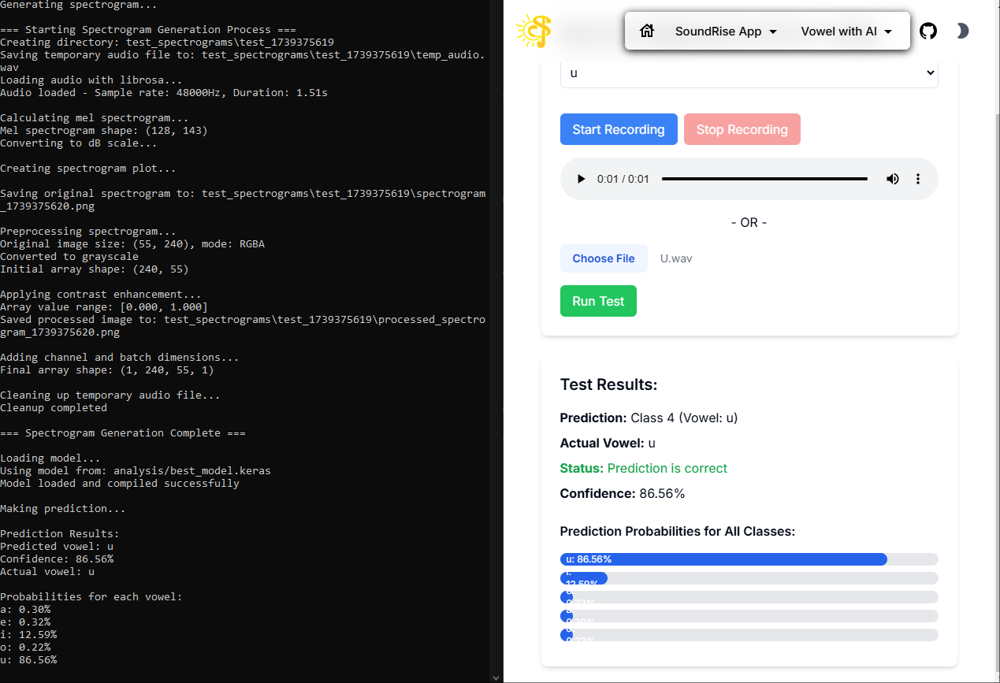

# CNN Image Classification Model Documentation

## Project Overview

This project implements a Convolutional Neural Network (CNN) for image classification, specifically designed to classify 5 different classes (A, E, I, O, U) of grayscale images.

## 1. Audio Data Preparation

The project includes a robust audio generation pipeline for creating training data using three different text-to-speech synthesis libraries for maximum versatility and quality:

### 1.1 Voice Synthesis Libraries

1. **Pyttsx3 Implementation**

   - Uses local system voices
   - Attempts to find and utilize Italian voice for authentic vowel pronunciation
   - Fallbacks to default system voice if Italian voice unavailable

2. **Edge-TTS Implementation**

   - Uses Microsoft Edge's Text-to-Speech service
   - Provides high-quality, cloud-based voice synthesis
   - Offers consistent voice quality across different systems

3. **Google Text-to-Speech (gTTS) Implementation**
   - Uses Google's TTS service for high-quality voice synthesis
   - Implements extensive vowel variations:
     - Standard pronunciations (e.g., "Ah", "Aah")
     - Extended vowels (e.g., "Aaaah", "Eeeeeh")
     - Emphasized forms (e.g., "AH", "EH")
     - Combined forms (e.g., "Aha", "Ehe")
     - Soft pronunciations (e.g., "ah", "eh")
   - Includes deliberate variations for robust testing
   - Implements filtering to remove incorrect pronunciations
4. **Online resources**
   - Trimmed some audio files from online Italian videos to be used as training data\
   - Downloaded some audio files from online Italian videos to be used as training data

### 1.2 Generation Parameters

- Base duration: 1000ms per vowel
- Number of variations: 200 per vowel
- Voice modulation parameters:
  - Rate variations: 60-240 WPM (10 different speeds)
  - Volume variations: 0.3-1.8 (9 different levels)
  - Pitch variations: ±2 semitones from base pitch
- Additional gTTS parameters:
  - Speed variations: normal and slow
  - Multiple Italian language codes: 'it', 'it-IT'
  - Text variations: lowercase, uppercase, extended forms

### 1.3 Audio Processing Pipeline

1. **Base Generation**

   - Generates initial vowel sound using any of the three TTS systems
   - Creates separate audio files for each variation
   - Allows switching between TTS systems for different voice characteristics

2. **Pitch Modulation**

   - Applies pitch shifts: -2, -1, 0, +1, +2 semitones
   - Creates additional variations for each base sound

3. **Optional Processing**
   - Noise addition capability (currently disabled)
   - Low-pass filtering (cutoff: 3000Hz)
   - Signal processing using scipy's butter filter
   - Quality filtering to remove incorrect pronunciations

### 1.4 File Organization

- Separate folders for each vowel (A, E, I, O, U)
- Naming convention:
  - Base files: `{vowel}_vars{variation}.wav`
  - Pitched variations: `{vowel}_varr{variation}_pitch{semitones}.wav`
  - gTTS variations: `{vowel}_var_{index}_{variation}_{speed}_{lang}.wav`
  - Online resources: `{vowel}_{index}.wav`

This comprehensive audio generation process, utilizing pyttsx3, Edge-TTS, and gTTS, ensures a diverse dataset with controlled variations in speed, volume, and pitch, providing robust training data for the CNN model. The multi-library approach allows for fallback options and quality comparison between different TTS systems. The inclusion of deliberate variations and subsequent filtering helps in creating a more robust and reliable dataset.

## 2. Image Data Preparation

The project converts audio files to visual representations using spectrograms, which are then used as input for the CNN model. Here's the detailed conversion process:

### 2.1 Spectrogram Generation

1. **Audio Processing Parameters**

   - Sample rate: Original audio sample rate preserved
   - FFT size: 2048 samples
   - Hop length: 512 samples
   - Mel bands: 128
   - Frequency range: 20Hz - 8000Hz

2. **Conversion Process**
   - Loads audio files using librosa
   - Computes mel spectrogram from audio waveform
   - Converts power spectrogram to decibel units
   - Uses logarithmic frequency scaling for better vowel feature representation

### 2.2 Image Specifications

- Output dimensions: 240x55 pixels
- Color format: Grayscale
- Visualization: 'magma' colormap
- Format: PNG
- No axes or margins in final image

### 2.3 Processing Pipeline

1. **Audio Loading**

   ```python
   y, sr = librosa.load(audio_path, sr=None)
   ```

2. **Spectrogram Computation**

   ```python
   mel_spect = librosa.feature.melspectrogram(
       y=y,
       sr=sr,
       n_fft=2048,
       hop_length=512,
       n_mels=128,
       fmin=20,
       fmax=8000
   )
   mel_spect_db = librosa.power_to_db(mel_spect, ref=np.max)
   ```

3. **Image Generation**
   - Creates figure with specific dimensions
   - Plots spectrogram using librosa's display function
   - Removes axes and margins
   - Saves as high-quality PNG

### 2.4 File Organization

- Images are organized in class-specific directories (A, E, I, O, U)
- Naming convention: `{vowel}_{index}.png`
- Each image represents the spectral content of a vowel sound
- Consistent image dimensions across all classes

This image generation process ensures:

- Standardized input format for the CNN
- Preservation of important vowel characteristics
- Clear visual distinction between different vowel classes
- Efficient storage and processing of audio features

### 2.5 Sample Images

| Class | Sample Image                 | Description               |
| ----- | ---------------------------- | ------------------------- |
| A     |  | Clear, centered vowel 'A' |
| E     |  | Clear, centered vowel 'E' |
| I     |  | Clear, centered vowel 'I' |
| O     |  | Clear, centered vowel 'O' |
| U     |  | Clear, centered vowel 'U' |

## 3. CNN Model Training

### 3.1 Dataset Organization

1. **Data Split Strategy**

   - Training set: 60%
   - Validation set: 20%
   - Test set: 20%
   - Random seed: 42 for reproducibility

2. **Dataset Size**
   | Class | Total Images |
   |-------|--------------|
   | A | 1551 |
   | E | 1551 |
   | I | 1550 |
   | O | 1550 |
   | U | 1550 |
   Total dataset size: 7752 images

3. **Directory Structure**
   ```
   base_dir/
   ├── train/
   │   ├── A/
   │   ├── E/
   │   ├── I/
   │   ├── O/
   │   └── U/
   ├── val/
   │   └── ...
   └── test/
       └── ...
   ```

### 3.2 Data Processing & Augmentation

1. **Image Preprocessing**

   ```python
   def preprocess_image(image):
       image = tf.cast(image, tf.float32) / 255.0
       mean = tf.reduce_mean(image)
       adjusted = (image - mean) * 1.5 + mean
       return tf.clip_by_value(adjusted, 0, 1)
   ```

2. **Data Augmentation Parameters**
   ```python
   train_datagen = ImageDataGenerator(
       preprocessing_function=preprocess_image,
       rotation_range=5,
       width_shift_range=0.05,
       height_shift_range=0.05,
       zoom_range=0.05,
       fill_mode='constant',
       cval=0
   )
   ```

### 3.3 Model Architecture

1. **Network Structure**

   - Input Layer: (240, 55, 1) - Grayscale images
   - 3 Convolutional Blocks:
     - Block 1: 32 filters, 3x3 kernel
     - Block 2: 64 filters, 3x3 kernel
     - Block 3: 128 filters, 3x3 kernel
   - Global Average Pooling
   - Dense Layer: 64 units
   - Output Layer: 5 units (softmax)

2. **Training Configuration**

   - Batch size: 8
   - Epochs: 100
   - Learning rate: 1e-4
   - Optimizer: Adam
   - Loss function: Categorical Crossentropy

3. **Training Callbacks**
   ```python
   callbacks = [
       EarlyStopping(
           monitor='val_accuracy',
           patience=20,
           restore_best_weights=True
       ),
       ReduceLROnPlateau(
           monitor='val_accuracy',
           factor=0.2,
           patience=5,
           min_lr=1e-6
       ),
       ModelCheckpoint(
           'best_model.h5',
           save_best_only=True,
           monitor='val_accuracy'
       )
   ]
   ```

### 3.4 Training Results

1. **Batch Size Experiments**
   | Batch Size | Training Accuracy (%) | Validation Accuracy (%) |
   |------------|----------------------|------------------------|
   | 8 | 95.85 | 98.77 |
   | 16 | 95.85 | 98.77 |
   | 32 | 95.85 | 98.77 |
   | 64 | 95.85 | 98.77 |

2. **Class-wise Performance**
   | Class | Accuracy (%) | Samples |
   |-------|-------------|---------|
   | A | 100.00 | 311 |
   | E | 99.36 | 311 |
   | I | 99.03 | 310 |
   | O | 99.68 | 310 |
   | U | 100.00 | 310 |

### 3.5 Model Evaluation

1. **Visualization Tools**

   - Training history plots
   - Confusion matrix
   - Prediction confidence distribution
   - Sample predictions visualization
   - Class distribution analysis

2. **Model Verification**
   - Model saved in .keras format
   - Verification through test set evaluation
   - Prediction comparison between original and loaded models

## 4. Model Evaluation

### 4.1 Backend API Implementation

The model is deployed as a Flask API service for real-time audio testing. Here's the detailed implementation:

1. **API Endpoint**

   ```python
   @app.route('/api/test-model', methods=['POST'])
   ```

   - Accepts POST requests with base64-encoded audio data
   - Processes audio files and returns vowel predictions

2. **Processing Pipeline**

   a. **Audio Input Processing**

   - Accepts base64-encoded audio data
   - Extracts file name for actual vowel validation
   - Decodes audio bytes for processing

   b. **Spectrogram Generation**

   ```python
   def create_spectrogram_from_audio_bytes(audio_bytes):
       # Load audio
       y, sr = librosa.load(temp_audio_path, sr=None)

       # Calculate mel spectrogram
       mel_spect = librosa.feature.melspectrogram(
           y=y,
           sr=sr,
           n_fft=2048,
           hop_length=512,
           n_mels=128,
           fmin=20,
           fmax=8000
       )

       # Convert to image
       mel_spect_db = librosa.power_to_db(mel_spect, ref=np.max)
   ```

3. **Model Prediction**

   - Loads trained model from saved file
   - Processes spectrogram through CNN
   - Returns prediction probabilities for each vowel

4. **Response Format**
   ```json
   {
     "success": true,
     "prediction": 0,
     "predictedVowel": "a",
     "actualVowel": "a",
     "isCorrect": true,
     "confidence": 0.98,
     "allProbabilities": {
       "a": 0.98,
       "e": 0.01,
       "i": 0.003,
       "o": 0.005,
       "u": 0.002
     }
   }
   ```

### 4.2 Model Validation

1. **Thorough Validation Process**

   ```python
   def validate_model_thoroughly(model, test_generator, class_names):
       results_by_class = {cls: {
           'correct': 0,
           'total': 0,
           'confidences': []
       } for cls in class_names}
   ```

2. **Per-Class Performance Metrics**

   - Accuracy percentage
   - Average confidence
   - Minimum confidence
   - Maximum confidence
   - Total samples tested

3. **Visualization Tools**
   - Confusion matrix generation
   - Performance metrics plotting
   - Confidence distribution analysis

### 4.3 Testing Results


I uploaded a self-recorded audio file to the backend API and got the following result:



- in the left, the api shows the result of the prediction
- in the right, the website shows the prediction result of the cnn model


## 5 Future Improvements

1. More training data from different sources
2. Add more epochs to compare with the best validation accuracy
3. Investigate potential overfitting and model optimization
4. Experiment with different model architectures
5. Implement cross-validation
